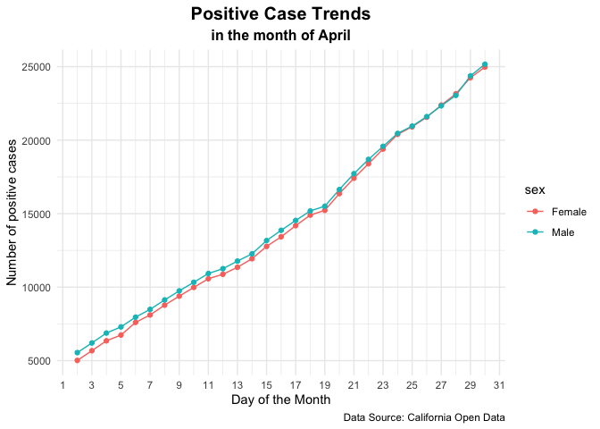
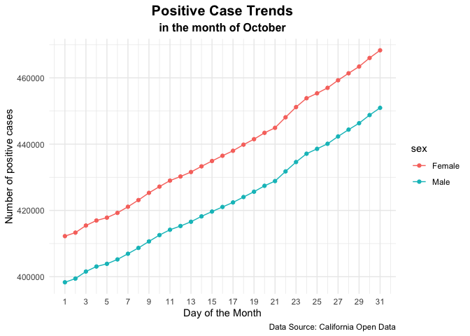
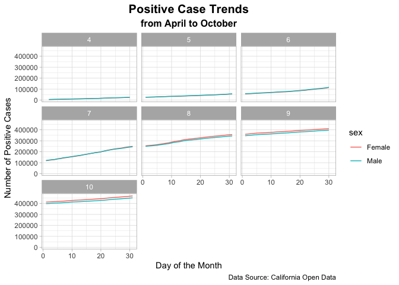
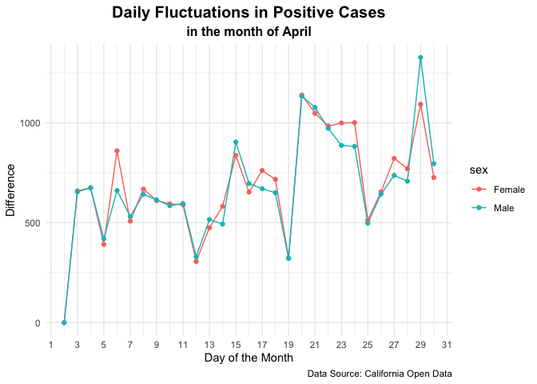
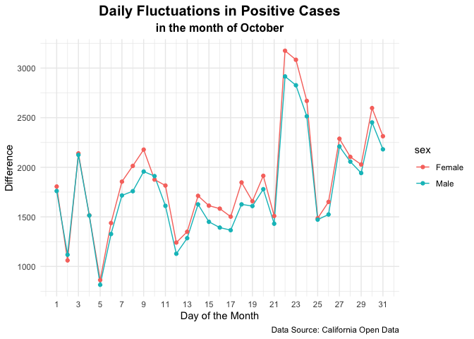
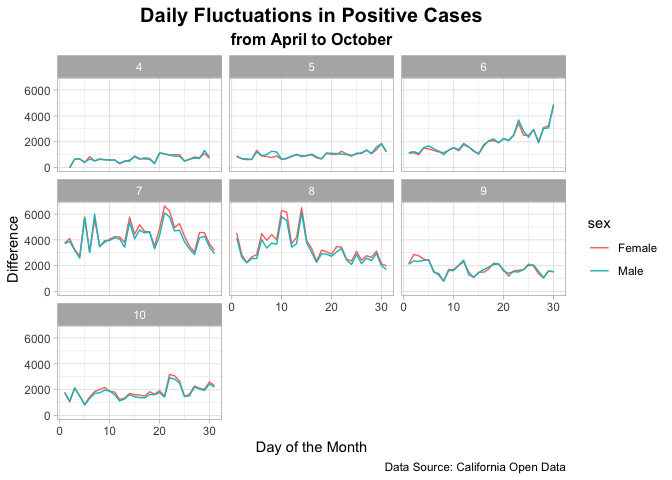

California COVID-19 Sex Demographic Analysis
================
Bowie Lam
12/25/2020

## Contents:

  - [Contents](#contents)
  - [Introduction](#introduction)
  - [Setting Up](#setting-up)
  - [Cleaning Data](#cleaning-data)
  - [Plotting Data](#plotting-data)

## Introduction

For this ultra-mini project, I want to:

1.  observe the trend of COVID-19 cases overtime for the male and female
    sexes,
2.  discover any discrepancies in cases between both sexes, and
3.  practice cleaning, graphing, and analyzing data

The below tasks are not intended to provide extensive knowledge into the
subject matter, rather they simply showcase a glimpse into the general
picture of the data; the observations provided for each task are meant
to be rudimentary. All in all, this exercise is done for fun and to gain
some new knowledge.

Thank you to [California Open Data](https://data.ca.gov/) for the data.
The direct link to the particular data set used and its dictionary can
be found [here](https://data.ca.gov/dataset/covid-19-cases).

## Setting Up

``` r
# load packages
library(ggplot2)
library(dplyr, warn.conflicts = FALSE)
library(readr)
library(bookdown)
library(here)
```

    ## here() starts at /Users/bowielam/Desktop/GitHub/COVID-19

``` r
# import data
df <- read.csv(here("raw_data", "case_demographics_sex.csv"), 
               na.strings = c("", ".", "NA", " ", "None"))
```

## Cleaning Data

``` r
# add a 'month' column
df$month <-as.numeric(substr(df$date, 6, 7))

# add a 'day' column
df$day <-as.numeric(substr(df$date, 9, 10))
```

``` r
# remove the following characteristics: 
# 'Transgender' and 'Unknown' from the 'sex' column; 
# 'November' from the 'month' column
df <- df %>% filter(sex != "Transgender", sex != "Unknown", month != 11)

# remove unneeded column
df$date <- NULL
df$case_percent <- NULL
df$deaths <- NULL
df$deaths_percent <- NULL
df$ca_percent <- NULL

# rename 'totalpositive2' column
colnames(df)[names(df) == "totalpositive2"] <- "total_positive"

# arrange by 'day', then arrange by 'month' (note: important for when diff() is used later on)
df <- df %>% arrange(day) %>% arrange(month)
```

``` r
# explore a particular month of the data frame e.g. where 'month' is '4'
april <- df %>% filter(month == 4)

april
```

    ##       sex total_positive month day
    ## 1  Female           5015     4   2
    ## 2    Male           5547     4   2
    ## 3  Female           5674     4   3
    ## 4    Male           6202     4   3
    ## 5  Female           6349     4   4
    ## 6    Male           6876     4   4
    ## 7  Female           6740     4   5
    ## 8    Male           7296     4   5
    ## 9  Female           7600     4   6
    ## 10   Male           7957     4   6
    ## 11 Female           8108     4   7
    ## 12   Male           8488     4   7
    ## 13 Female           8776     4   8
    ## 14   Male           9130     4   8
    ## 15 Female           9387     4   9
    ## 16   Male           9745     4   9
    ## 17 Female           9981     4  10
    ## 18   Male          10330     4  10
    ## 19 Female           9981     4  10
    ## 20   Male          10330     4  10
    ## 21 Female          10571     4  11
    ## 22   Male          10926     4  11
    ## 23 Female          10877     4  12
    ## 24   Male          11256     4  12
    ## 25 Female          11352     4  13
    ## 26   Male          11772     4  13
    ## 27 Female          11934     4  14
    ## 28   Male          12265     4  14
    ## 29 Female          12771     4  15
    ## 30   Male          13169     4  15
    ## 31 Female          13424     4  16
    ## 32   Male          13865     4  16
    ## 33 Female          14185     4  17
    ## 34   Male          14535     4  17
    ## 35 Female          14902     4  18
    ## 36   Male          15185     4  18
    ## 37 Female          15224     4  19
    ## 38   Male          15507     4  19
    ## 39 Female          16363     4  20
    ## 40   Male          16641     4  20
    ## 41 Female          17411     4  21
    ## 42   Male          17718     4  21
    ## 43 Female          18395     4  22
    ## 44   Male          18690     4  22
    ## 45 Female          19394     4  23
    ## 46   Male          19577     4  23
    ## 47 Female          20395     4  24
    ## 48   Male          20459     4  24
    ## 49 Female          20908     4  25
    ## 50   Male          20957     4  25
    ## 51 Female          21562     4  26
    ## 52   Male          21600     4  26
    ## 53 Female          22384     4  27
    ## 54   Male          22337     4  27
    ## 55 Female          23154     4  28
    ## 56   Male          23045     4  28
    ## 57 Female          24247     4  29
    ## 58   Male          24372     4  29
    ## 59 Female          24973     4  30
    ## 60   Male          25167     4  30

Notice that there are duplicate rows in the `april` data frame
e.g. where month = 4 and day = 10.

Create a function:

  - to remove duplicate rows
  - to double check for duplicates

<!-- end list -->

``` r
#' @title Duplicate Row Remover
#' @description removes duplicated rows from a data frame
#' @param dataframe is a table or two-dimensional array-like structure/object
#' @return a data frame that no longer has duplicate rows

remove_dup <- function(dataframe) {
  return(dataframe[!duplicated(dataframe), ])
}
```

``` r
#' @title Duplicate Row Checker
#' @description double checks that are no duplicate rows in the data frame
#' @param dataframe is a table or two-dimensional array-like structure/object
#' @return a character message indicating if there are any duplicates in the data

check_for_dups <- function(dataframe) {
  len = dataframe %>% group_by(day) %>% count() %>% pull(n) %>% unique() %>% length()
  if (len != 1) {
    print("Oh, no! There are duplicates in this dataset! :( ")
  } else {
    print("Yay! There are no duplicates in this dataset! :) ")
  }
}
```

Test the function `remove_dup()`.

``` r
# this data frame has duplicate rows
female_4 <- april %>% filter(sex == "Female")

# this data frame does not have duplicate rows
female_4_cleaned <- remove_dup(female_4)

check_for_dups(female_4)
```

    ## [1] "Oh, no! There are duplicates in this dataset! :( "

``` r
check_for_dups(female_4_cleaned)
```

    ## [1] "Yay! There are no duplicates in this dataset! :) "

Remove duplicate rows from the entire `df` data frame using
`remove_dup()`.

``` r
# apply 'remove_dup()' to the data frame
df <- remove_dup(df)
```

## Plotting Data

### Functions

``` r
#' @title Case Plotter
#' @description used to produce a plot with a changing y-variable
#' @param table a two-dimensional array-like structure
#' @param month_num is if type int, and is the number of the specified month
#' @param y_variable is of type chr, and is the variable to be plotted on the y-axis
#' @param main_title is of type chr, and is the primary title of the plot
#' @param sub_title is of type chr, and is the secondary title of the plot
#' @param y_title is of type chr, and is the title of the y-axis
#' @return a dotted line plot

plotting <- function(table, month_num, y_variable, main_title, sub_title, y_title) {
  ggplot(data = table %>% filter(month == month_num), 
       aes_string(x = "day", y = y_variable, color = "sex", group = "sex")) +
  geom_line() + geom_point() +
  scale_x_continuous(breaks = seq(min(table$day), max(table$day), 2)) +
  labs(title = main_title, subtitle = sub_title, x = "Day of the Month", 
       y = y_title, caption = "Data Source: California Open Data") +
  theme_minimal() +
  theme(plot.title = element_text(size = 15, face = "bold", hjust = 0.5), 
        plot.subtitle = element_text(size = 12, face = "bold", hjust = 0.5))
}
```

``` r
#' @title Facet Plotter
#' @description used to produce multiple plots faceted by a specified variable
#' @param table two-dimensional array-like structure
#' @param y_variable is of type chr, and is the variable to be plotted on the y-axis
#' @param main_title is of type chr, and is the primary title of the plot
#' @param sub_title is of type chr, and is the secondary title of the plot
#' @param y_title is of type chr, and is the title of the y-axis
#' @return a plot that consists of multiple line plots

facet_plotting <- function(table, y_variable, main_title, sub_title, y_title) {
  ggplot(data = table, 
         aes_string(x = "day", y = y_variable, color = "sex", group = "sex")) +
  geom_line() + facet_wrap(~ month) +
  labs(title = main_title, subtitle = sub_title, x = "Day of the Month", 
       y = y_title, caption = "Data Source: California Open Data") +
  theme_light() +
  theme(plot.title = element_text(size = 15, face = "bold", hjust = 0.5), 
        plot.subtitle = element_text(size = 12, face = "bold", hjust = 0.5))
}
```

### Graphs and Analysis

After cleaning the data and creating the required plotting functions, we
are now ready to use the processed information to answer some meaningful
questions. For this section, I will aim to answer the following: **Is
there a gender difference in the people who test positive for COVID-19
in California?**

This research question is of interest because it’s crucial to discern if
there are particular groups in society who are more susceptible to the
infectious disease when compared to their counterparts. These groups can
be identified on the basis of race, color, religion, gender, age,
disability, etc. If such disadvantaged groups exist, efforts should be
made by government officials, public health professionals, and the alike
to devise solutions to the inequity.

#### Task 1: Positive Case Trends

Upon first look at Plot 1A and Plot 1B, it’s clear that there is a
difference in the number of total positive cases between sexes when
comparing the first month, April, to the last month, October. In Plot
1A, the graph displays a similar increase in the number of positive
cases between males and females; however, in October, the gap
drastically widened at a consistent rate. It’s evident that females are
testing positive more often than males. This observation suggests that
females are disproportionately affected by COVID-19 than their male
counterparts. One of many explanations for this could be the difference
in occupations between the sexes. Perhaps females tend to be in roles
that have a higher risk of exposure to COVID-19 than the roles of males.

The difference in positive case trends for all months is displayed in
Plot 1C. For the first four months, April to July, both sexes appear to
experience a similar increase. However, beginning in August it’s clear
that females began to gradually surpass males in the total number of
positive cases.

##### **Plot 1A**

``` r
# plot the trend of positive cases in the first month, April, for both sexes
plotting(df, 4, "total_positive", "Positive Case Trends", "in the month of April", 
         "Number of positive cases")
```



##### **Plot 1B**

``` r
# plot the trend of positive cases in the last month, October, for both sexes
plotting(df, 10, "total_positive", "Positive Case Trends", "in the month of October", 
         "Number of positive cases")
```



##### **Plot 1C**

``` r
# plot the trend of positive cases in all months, April to October, for both sexes
options(scipen = 999)
facet_plotting(df, "total_positive", "Positive Case Trends", "from April to October", 
               "Number of Positive Cases")
```



#### Task 2: Daily Fluctuations in Positive Cases

From Task 1 above, it was observed that there are more positive cases
among females than there are among males. In this task, a closer look at
daily fluctuations in positive cases is made. In both Plot 2A and Plot
2B, both sexes again display a similar trend in positive cases. In the
first month, April, both sexes experienced nearly the same number of
peaks in daily positive cases. However, in the last month, October,
females undoubtedly peaked more than males.

The difference in daily fluctuations in positive cases for all months,
April to October, is showcased in Plot 2C. Although the data shows a
similar pattern in movement between both sexes, females are affected
more than males, which can be discerned by the peaks in daily cases.

``` r
# create a dataframe where `sex` is `Female` and `Male`
females_df <- df %>% filter(sex == "Female")
males_df <- df %>% filter(sex == "Male")

# add a 'difference' column to `females_df` and `males_df`
females_df$difference <- c(0, diff(females_df$total_positive))
males_df$difference <- c(0, diff(males_df$total_positive))

# combine `females_df` and `males_df` and reassign to `df`
df <- rbind(females_df, males_df)
```

##### **Plot 2A**

``` r
# plot the difference in positive cases in the first month, April, for both sexes
plotting(df, 4, "difference", "Daily Fluctuations in Positive Cases", 
         "in the month of April", "Difference")
```



##### **Plot 2B**

``` r
# plot the difference in positive cases in the last month, October, for both sexes
plotting(df, 10, "difference", "Daily Fluctuations in Positive Cases", 
         "in the month of October", "Difference")
```



##### **Plot 2C**

``` r
# plot the difference in positive cases in all months, April to October, for both sexes
facet_plotting(df, "difference", "Daily Fluctuations in Positive Cases", 
               "from April to October", "Difference")
```


